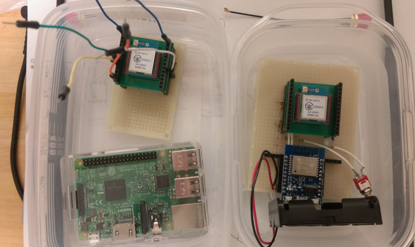
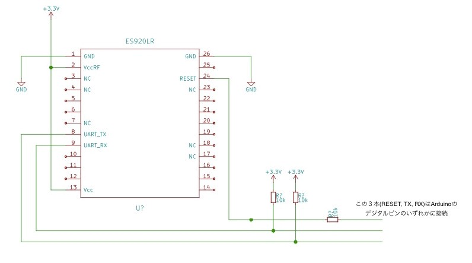
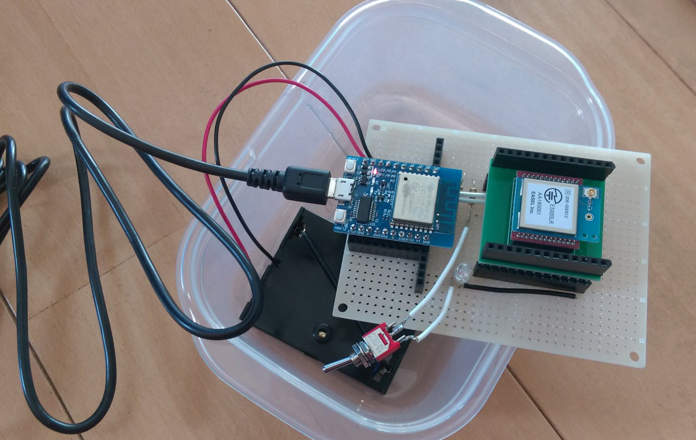
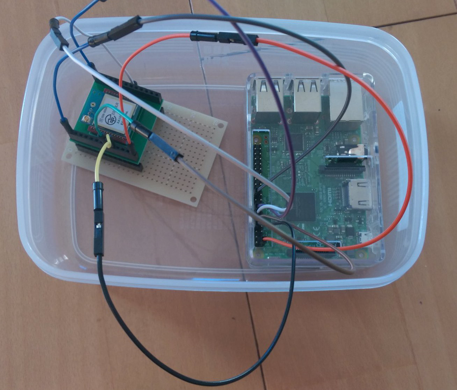
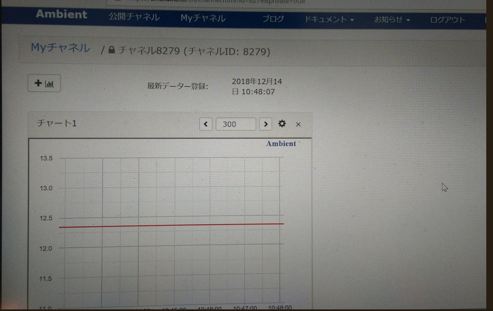

# Lora_Ambient
Loraモジュールによる通信  
全体図(アンテナをつけていない状態)  

# 1.使用製品
今回はEASEL社のモジュールを使用した。  
・Loraモジュール本体　https://tokyodevices.jp/items/251  
・ダイポールアンテナ　https://tokyodevices.jp/items/243  
・ピッチ変換基盤　https://cosmobrain.stores.jp/items/5bdd4b20ef843f45760000e4等  

# 2.モジュール情報のありか
コマンド仕様などの詳しい情報は以下からダウンロード可能  
http://easel5.com/download/  

# 3.【実験】Arduinoとraspberry pi3とにつないで通信をしてみる
・このサイトを参考にした　https://ambidata.io/examples/lora-2/  
・コードはここ　https://github.com/AmbientDataInc/LoRa-rssi-measure  
・変更すべき箇所が２点  
### 親機側のプログラムmain.pyのsetMode関数の77行目と78行目の間に、以下の４行を追加
sendcmd('node 1\r\n') //親機に設定  
sendcmd('ownid 0000\r\n') //自ノードアドレスを0に  
sendcmd('rssi 1\r\n') //信号強度情報を取得  
sendcmd('rcvid 1\r\n') //送信元アドレス情報を取得  
### 子機の電子回路でES920LRのRESET(24番)ピンにつながっているプルアップ抵抗は不要（図で示すと以下のようになる）

# 4.写真
EsprDeveloper(子機側)  

RaspberryPi3(親機側)  

IoTサービスAmbientによるデータの視覚化  

# 5.諸注意
### 初めてラズパイでシリアル通信をする場合の注意
・「ラズベリーパイの設定(Raspberry Pi Configuration)」でシリアル通信を有効化する  
・再起動が必要  
・$sudo leafpad /boot/cmdline.txt というコマンドで開いたファイルを編集する  
・「console=serial0,115200」を削除し、保存、再起動  
・これでシリアル通信ができるようになるはず  

### AmbientのPythonライブラリ（import ambient）を使う方法
・以下のコマンドでインストール  
    $ pip install git+https://github.com/AmbientDataInc/ambient-python-lib.git  
    $ pip freeze | grep ambient  
      ambient==0.1.2  
      
# 6.現在の問題
### UNOとloraモジュールのUART通信が上手くいかない
EsprDeveloperで出来たLora通信をarduino unoでも試してみたけど、上手く行かなかった…  
原因：SoftwareSerialの115200だと不安定らしい？ https://www.petitmonte.com/robot/softwareserial_bug.html  
解決法：UNOとEsprDeveloperをハードウェアシリアルやSoftwareSerialの9600で通信してデータを送る？  
https://shizenkarasuzon.hatenablog.com/entry/2018/07/24/225915  
http://discexuno.wp.xdomain.jp/arduino/arduino_and_esp8266_2/  
https://qiita.com/T-YOSH/items/0ce41136c535c723affb

